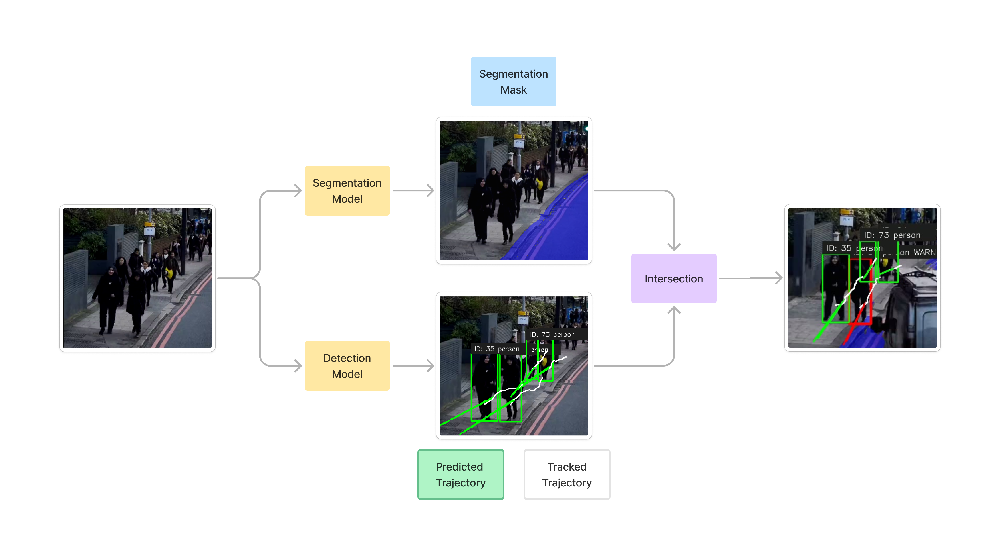
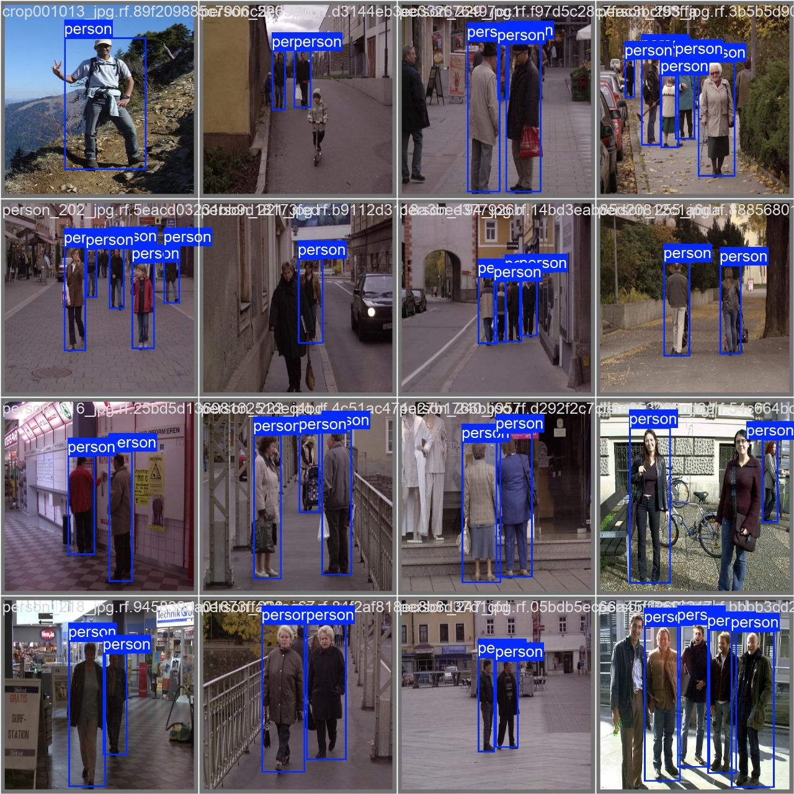
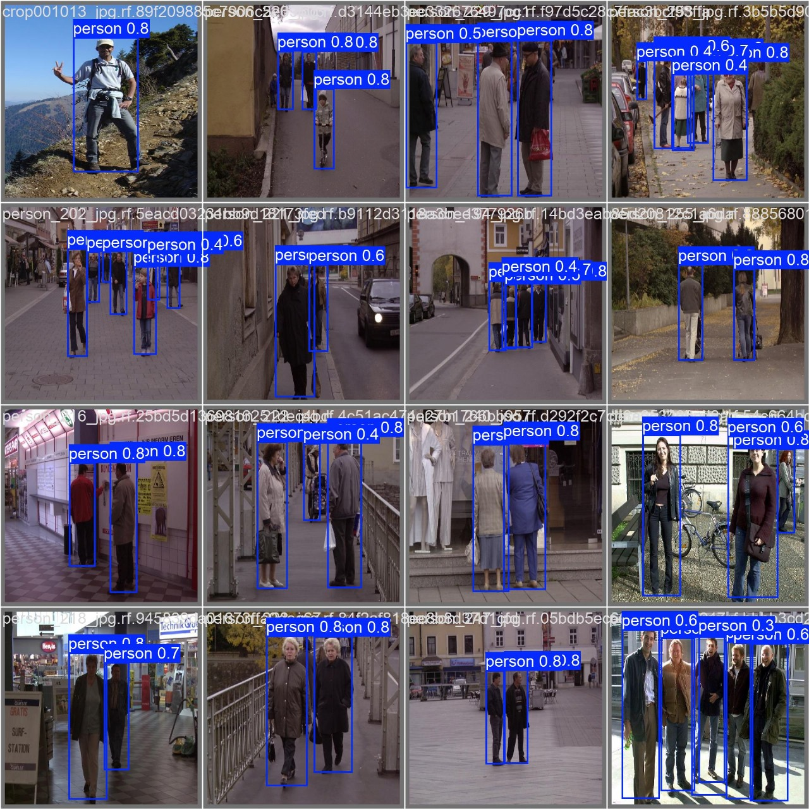
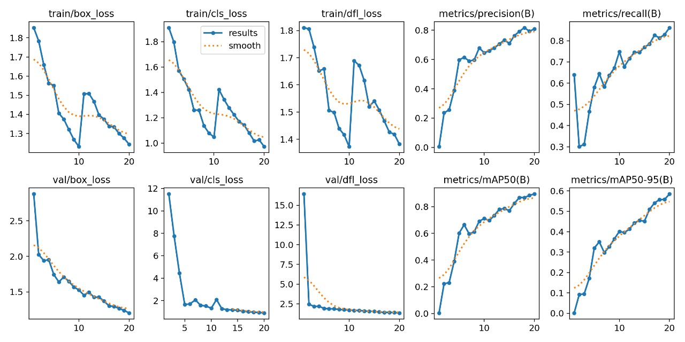

## Getting Started

```bash
pip install torch torchvision torchaudio
pip install ultralytics lapx
pip install onnxruntime
```

OR

```bash
pip install -r requirements.txt
```

Download the segmentation model from [here](https://github.com/PINTO0309/PINTO_model_zoo/tree/main/136_road-segmentation-adas-0001) and place it in the `saved_model` directory in the root of the repo.

To run the code, use the following command:

```bash
python ped_track.py --source src
```

where `src` can be:

1. 0 for camera
2. path to video file

## Working

The repo uses two models:

1. YOLOv8 for detecting pedestrians
2. Segmentation model for segmenting the road

First, the pedestrians are detected using YOLOv8 and their trajectory is tracked using `botsort`. The tracked trajectory is smoothened using a moving average filter. Then the smooth trajectory is used to predict the future trajectory of the pedestrian using linear extrapolation and Kalman filtering.

Simultaneously, the road is segmented using a segmentation model. If the predicted trajectory of the pedestrian intersects with the road, the pedestrian is flagged and a warning is issued to the driver.

Following image shows the working of the system:



YOLOv8 model was trained on Caltech Pedestrian dataset and a pre-trained model was used for segmentation.

# Training

Following figure shows the ground truth for the dataset:



And the following figure shows the prediction of YOLOv8 trained on the dataset:



Following figure shows the training results:



## References

The segmentation model was taken from [here](https://github.com/openvinotoolkit/open_model_zoo/tree/master/models/intel/road-segmentation-adas-0001)

| Metric           | Value     |
| ---------------- | --------- |
| Image size       | 896x512   |
| GFlops           | 4.770     |
| MParams          | 0.184     |
| Source framework | PyTorch\* |

The quality metrics calculated on 500 images from "Mighty AI" dataset
that was converted for four class classification task are:

| Label    | IOU       | ACC       |
| -------- | --------- | --------- |
| **mean** | **0.844** | **0.899** |
| BG       | 0.986     | 0.994     |
| road     | 0.954     | 0.974     |
| curbs    | 0.727     | 0.825     |
| marks    | 0.707     | 0.803     |
